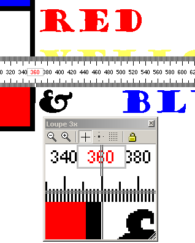
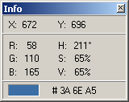
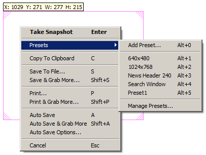

## Description

TopTools is a set of utilities for web-designers and GUI-developers.

It features a screen-loupe and a screen-ruler seamlessly working together,
additional are a color-picker, a screen-grabber and a base-converter.

TopTools is "portable", you can run it from a USB-stick and it will not
make any changes to the computer you plug it into (unless you ask it to).

TopTools will run on any version of Windows not older than Win98, however on
multi-monitor systems running Windows 10, it can show incorrect results
when the DPI-settings of attached monitors are not all the same.

## Introduction

I developed TopTools through the years as I was confronted with questions
like:

  * How can I get a closer look at this icon?
  * How many pixels should I move this image to align with the rest?
  * What is the height of this image?
  * What is the RGB value of this pixel?
  * How can I get this part of the screen as image on the clipboard?
  * How can I print this part of the screen?
  * What was the ASCII value of this character again?
  * What is 10110110 in hexadecimal (or vice versa)?

## Features

### General

All tool windows show a menu when clicked with the right mouse button.

### Ruler

The ruler measures screen objects in pixel units. It has a floating position
indicator that follows the mouse pointer. The mouse pointer has a line shape
that flips when moved across the center of the ruler, in this way both sides
of the ruler can be used.

The ruler orientation can be toggled through the popup menu or by clicking
the middle mouse-button, it can be moved with the arrow-keys or by dragging it
with the mouse.

### Loupe

The loupe displays an enlarged view of the area around the mouse pointer,
optionally a crosshair can be shown to indicate the exact hotspot location.

The zoom factor can be adjusted between 1 and 20 times and can be
controlled with the mousewheel or by pressing the numeric '+' and '-'
keys.

The view can be frozen (detached from mouse movement) by hitting the
spacebar, so it is possible to keep the magnified view of a screen part in
focus.

The focus point of the frozen view can be moved by dragging it with the
mouse.

A frozen view can be saved to file, copied to the clipboard or sent to a printer.

### Info Window / Color Picker

The info-window displays the color of the pixel under the mouse hotspot as
RGB, HSV and #webcolor, it also shows the current mouse position in
screen coordinates.

By pressing 'Ctrl-C' (or a user definable hotkey) the current color is copied
to the clipboard in RRGGBB format, optionally prefixed with a '#' and/or
surrounded by quotes. It is also possible to define a custom format.

Often you want to know mouse coordinates relative to the underlying
window instead of relative to the top-left of the desktop.
You can left-click and drag from the info-window to show these
relative coordinates.

### Screen Grabber

The screen grabber captures a portion of the screen, it shows
a sizeable, transparent window that can be accurately positioned by using the
mouse or the keyboard arrow-keys.

Screen-capture can be activated with a global hotkey.

Grabbed View can be opened in a window, saved to file, copied to the clipboard or
printed.

Autosave features make it easy to capture a sequence of views with a minimum
of keystrokes.

Commonly used dimensions can be saved in a preset list, to be selected later.

### Base Converter

The base converter is a tiny calculator that converts between hexadecimal,
decimal and binary. It can also be used to find the ASCII value of printable
characters.

## History

TopTools was born when I was using a screen-magnifier and a screen-ruler at
the same time and was annoyed by the fact that the two didn't cooperate:

The magnifier showed the portion of the screen that is left of and above the
hotspot of the mouse pointer instead of a portion _around_ the hotspot. So
when the magnifier was used together with the ruler, one would see either a
close-up of the ruler, or a close-up of what was really to be measured, but
with the ruler out of sight.

The ruler was actually quite good, but it came up
with annoying shareware nag-boxes and I thought the price was a bit high for
such a simple program, so I decided to create my own.

Later I added some other little utilities, like the base-converter and the
color-picker.

Screen capture was the latest addition to the tools.

The initial version was developed using Borland C++ 5.0 and the Object Windows
Library. Later versions were adapted to and maintained with Borland C++Builder
3, 4 and 5.

## Acknowledgements

  * GIF support: [TGifImage](http://melander.dk/delphi/gifimage/) by Anders Melander.
  * PNG support: [TPNGImage](http://pngdelphi.sourceforge.net/) by Gustavo Daud.
  * Installer: [InnoSetup](http://www.jrsoftware.org/isinfo.php) by Jordan Russell.

